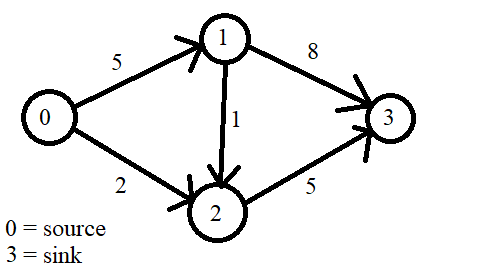
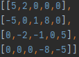

# TeoriaGrafowProjekt

## Część analityczna
Część analityczna znajduje się w pliku "JakubHulekTeoriaGrafowCzescAnalityczna.pdf".  
W analizie grafu posłużyłem się kodem znajdującym się w pliku "analiza.py", nie należy on do drugiej części.  

## Część programistyczna
### Wprowadzenie danych
W pliku "graph.json" znajduje się przykładowa macierz incydencji dla następującego grafu nieskierowanego. 
  
Tak wygląda macierz incydencji dla tego grafu  
  
Wartości w tabeli oznaczają maksymalną przepustowość pomiędzy wierzchołkami.  
Pierwszy wiersz to wiersz wierzchołka, który jest źródłem, a ostatni wiersz, to wiersz ujścia.  
Aby rozpatrzeć inny graf należy wprowadzić jego macierz incydencji do pliku "graph.json" w tym samym formacie jak przykład.  

### Uruchomienie algorytmu
Aby uruchomić algorytm należy uruchomić plik "algorithm.py", używając np.: PyCharm.  
Algorytm zbuduje graf na podstawie podanej macierzy incydencji, a następnie wypisze wartość maksymalnego przepływu uzyskane przy pomocy algorytmu Edmondsa-Karpa.

### Analiza algorytmu i jego zastosowania
Metodę Forda-Fulkersona wykorzystuje się do rozwiązywania problemów maksymalnego przepływu.  
Używa się ją, między innymi, przy turniejach baseballa do wyłownienia drużyny, która zostanie wyeliminowana. Drużyna zostaje wyeliminowana, jeśli nie ma szans zdobycia pierwszego miejsca. Problem ten można rozwiązać przy pomocy metody Forda-Fulkersona.  
Innym przykładem zastosowania może być planowanie lotów samolotowych, czy planowanie łańcuchów dostaw.  
Na przestrzeni lat, poza algorytmem Edmondsa-Karpa, wymyślono i używano takich algorytmów jak:
- algorytm Dinitza
- algorytm Goldberga i Tarjana
- algorytm Goldberga i Rao
- algorytm Jamesa B. Orlina